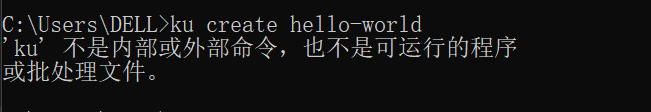
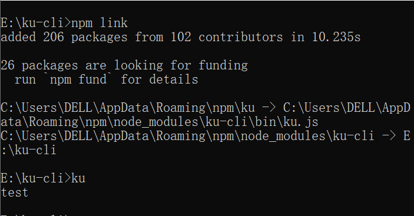
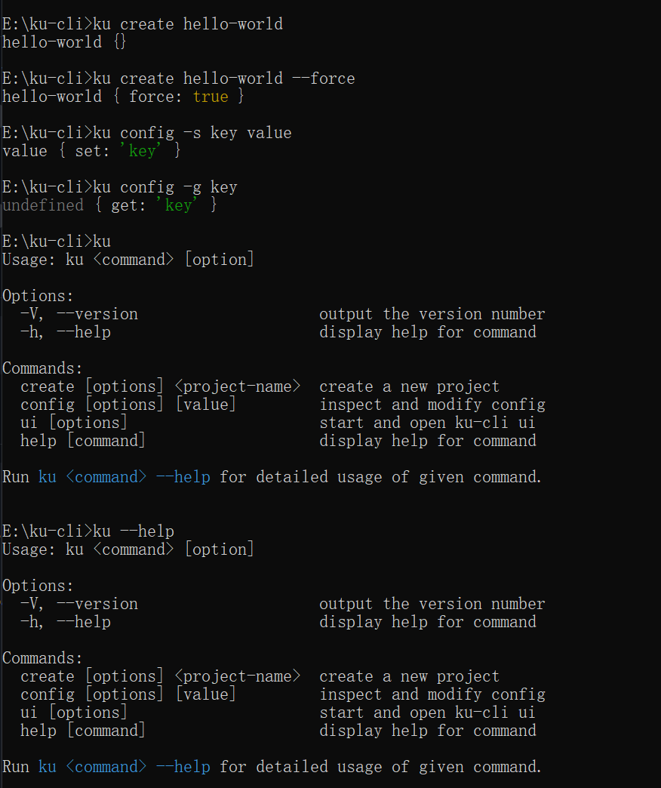
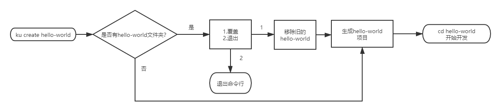
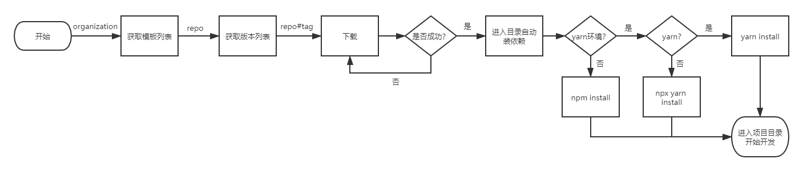

# 如何写一个CLI(脚手架)，看看这篇文章就够了
平常我们创建项目的时候可能会发现这个项目创建的目录结构或者组织架构还或者一部分代码组织跟我之前的某个项目有很多共同之处，如果这样的情况频次比较高的话，我们会做很多重复性的工作，这就很low，所以有没有一个工具可以帮我们把这些事情做了呢

我们是希望这个工具可以做到，当我们做A类型项目的时候，输入几行命令，选择一下模板直接就帮我们下载好了A类型的项目结构，B类型的时候就会生成B类型的项目结构，这样我们就有更多的时间专注业务逻辑层的东西；下面我就教大家一步一步实现一个ku-cli

## 目录结构

```
ku-cli
├─ .gitignore
├─ .npmignore
├─ api
│  └─ index.js//调用接口文件
├─ bin
│  └─ ku.js //命令行入口文件
├─ lib
│  ├─ config.js//ku config 具体的执行入口文件
│  ├─ create.js//ku create 具体的执行入口文件
│  └─ Creator.js// 创建项目的类
├─ package-lock.json
├─ package.json
├─ README.md
└─ utils//一些方法库
   ├─ axios.js
   ├─ common.js
   └─ env.js
```

## 设计输入命令行

写代码前我们应该先设计一下输入什么样的命令行，来做怎样的事情，这里我们可以想一下vue-cli和create-react-app的一些用法，比如

```shell
//<>表示必填项，[]表示选填项
ku create <project-name> [options]//创建一个项目
//create options
-f,--force // 强制创建项目
ku config [options] //设置配置文件
// config options
-g,--get <key> //获取配置文件的某一项
-s,--set <key> <value> //给配置文件设置一项
-d,--delete <key> //删除某一项
-a,--all [options] //获取配置文件的全部项
```

在什么也不做的情况下，在命令窗口输入这些命令肯定会报错的：



要想使命令行可用，我们需要配置一下package.json文件,如下：[关于package.json中bin字段的详细介绍](https://docs.npmjs.com/cli/v7/configuring-npm/package-json#bin)

```json
//大致的意思就是当我们输入 ku 命令的时候，会去寻找bin/ku.js文件然后执行;
// ku => node ./bin/ku.js
{
  "bin": {
    "ku": "./bin/ku.js",
     //"ku-cli":"./bin/ku.js",//当然这里也可以指定多个命令指令,命令行中输入ku-cli的时候也会走node ./bin/ku.js
  },
}
```

`bin/ku.js`：

```javascript
//执行这段代码的环境是node环境
#! /usr/bin/env node 
console.log('test')
```

在命令行中输入`ku`命令之前，我们需要把当前的项目关联到全局中（可以理解为npm install ku-cli -g），在当前项目的目录执行`npm link`：[npm link详细介绍](https://docs.npmjs.com/cli/v7/commands/npm-link)



我们看到成功打印出了`test`

## 会用到的第三方库

- [commander](https://github.com/tj/commander.js#readme)，完整的 [node.js](http://nodejs.org/) 命令行解决方案；
- [chalk](https://github.com/chalk/chalk#readme)，让终端打印的字符串有更好的样式；
- [inquirer](https://github.com/SBoudrias/Inquirer.js#readme)，交互式命令行；
- [download-git-repo](https://gitlab.com/flippidippi/download-git-repo#readme)，下载git仓库资源；
- [fs-extra](https://github.com/jprichardson/node-fs-extra#readme)，fs模块的扩展；
- [cross-spawn](https://github.com/moxystudio/node-cross-spawn#readme)，nodejs spawn和spawnSync方法的跨平台解决方案；
- [log-symbols](https://github.com/sindresorhus/log-symbols#readme)，不同颜色的状态图标(info|success|warning|error)；
- [ora](https://github.com/sindresorhus/ora#readme)，命令行加载动画；
- [configstore](https://github.com/yeoman/configstore#readme)，本地存储json文件；
- [ejs](https://ejs.co/#install)，模板渲染编译；

## 实现命令行交互

接下来我们开始做一下我们之前设计好的命令行，这时候会用到commander命令行工具：

`bin/ku.js`

```javascript
import program from 'commander'
import chalk from 'chalk' 
//import create from '../lib/create.js'
//import config from '../lib/config.js'
import { packageJson } from '../utils/common.js'
// 1. 创建项目
program.command('create <project-name>')
    .description('create a new project')//用来描述create命令干啥的
	// 第一参数为可选项的简写可全写，第二个参数是对第一参数的描述信息，用来描述这个option是干啥的
	// 执行ku create project-name --force的时候，如果当前目录有个叫project-name的目录就直接强制替换 
    .option('-f,--force', 'overwrite target directory if it exists')
    .action((pn, cmd) => {//执行完这个命令后的回调函数
    	console.log(pn,cmd)
        //create(pn, cmd);
    })
// 2. 设置配置文件
program.command('config [value]')
    .description('inspect and modify config')
    .option('-g,--get <path>', 'get value from option')// 获取某个配置项
    .option('-s,--set <path> <value>', 'set config')//设置一个配置项
    .option('-d,--delete <path>', 'delete value from option')//删除一个配置项
    .option('-a,--all [value]', 'get all config')//获取所有配置项
    .action((v, cmd) => {
        //config(v, cmd)
    })
// 输入 ku 命令的时候会输出这个工具的具体使用方法
program.usage('<command> [option]')
    .version(packageJson.version)
// 监听到help命令：ku --help时会调用回调函数
program.on('--help', () => {
    console.log()
    console.log(`Run ${chalk.cyan('ku <command> --help')} for detailed usage of given command.`)
    console.log()
})
// 解析进程中的参数
program.parse(process.argv)
```

接下来我们测试一下：



## 实现项目创建

### 交互逻辑流程



这里主要是要判断创建的项目是否有重名的，有重名的并且没有`--force`选项的情况下，会有一个选择覆盖呢还是退出的逻辑：

`lib/create.js`

```javascript
import path from 'path'
import fs from 'fs-extra'
import inquirer from 'inquirer'
import Creator from './Creator.js'
export default async (projectName, options) => {
    const cwd = process.cwd();//获取当前命令行所在目录
    const targetPath = path.join(cwd, projectName)//生成项目路径
    if (fs.existsSync(targetPath)) {//如果有这个路径
        if (options.force) {// 有--force 的情况下直接移除旧的项目
            await fs.remove(targetPath)
        } else {
            //否则的话选择是要覆盖呢还是退出
            const { action } = await inquirer.prompt([
                {
                    name: "action",
                    type: 'list',
                    message: 'Target directory already exists,please choose an action:',
                    choices: [
                        {
                            name: "Overwrite",
                            value: 'overwrite'
                        },
                        {
                            name: "Cancel",
                            value: false
                        }
                    ]
                }
            ])
            // 如果是退出就直接退出
            if (!action) return;
            else {
                //否则的话就是移除旧的
                console.log('\r\nRemoving ...')
                await fs.remove(targetPath)
            }
        }
    }
    // 创建项目
    const creator = new Creator(projectName, targetPath)
    creator.create()
}
```

### 生成项目




根据流程图可以看出我们需要在github上创建一个organization，里面会单独存放各种模板，每个repository打一些tags，通过organization/repo#tag获取模板内容，这里面会有下载失败的情况，下载失败了会重新下载直到成功，下载资源成功后会自动进入目录下载依赖。

大致分为三步

1. 获取模板名称
2. 获取版本号
3. 下载，自动安装依赖

`lib/Creator.js`

```javascript
import { fetchRepos, fetchTags } from '../api/index.js'
import inquirer from 'inquirer'
import { wrapLoading, configStore } from '../utils/common.js'
import { promisify } from 'util'
import downloadRepo from 'download-git-repo'
import fs from 'fs-extra'
import path from 'path'
import spawn from 'cross-spawn'
import chalk from 'chalk'
import { hasYarnProject, hasYarn } from '../utils/env.js'

const downloadGitRepo = promisify(downloadRepo)//将downloadRepo函数promise化

class Creator {
    constructor(projectName, targetPath) {
        this.name = projectName;
        this.target = targetPath;
    }
    async create() {
        //1. 获取项目模板名称
        const repo = await this.getRepo()
        // 2. 获取版本号
        const tag = await this.getTag(repo)
        // 3. 下载
        await this.download(repo, tag)
    }
    _spawn() {
        const isYarnProject = hasYarnProject(this.name)
        const isYarn = hasYarn();
        //将安装的输出信息由子进程输出到主进程
        spawn(isYarnProject ? isYarn ? 'yarn' : 'npx' : 'npm', isYarnProject ? isYarn ? [] : ['yarn'] : ['install'], {
            cwd: this.target,
            stdio: ['pipe', process.stdout, process.stderr]
        })
            .on('close', () => {
                console.log()
                console.log(`Successfully created project ${chalk.yellowBright(this.name)}`)
                console.log('Get started with the following commands:')
                console.log()
                console.log(chalk.cyan(`cd ${this.name}`))
                console.log(chalk.cyan(isYarnProject ? 'yarn start\r\n' : `npm run serve\r\n`))
            })
    }
    async getRepo() {
        let repos = await wrapLoading(fetchRepos, 'wait fetch repo ...')
        if (!repos) return;
        repos = repos.map(repo => repo.name)
        const { repo } = await inquirer.prompt({
            name: "repo",
            type: "list",
            choices: repos,
            message: 'please choose a project template'
        })
        return repo
    }
    async getTag(repo) {
        let tags = await wrapLoading(fetchTags, 'wait fetch tag...', repo)
        if (!tags) return;
        tags = tags.map(repo => repo.name)
        const { tag } = await inquirer.prompt({
            name: "tag",
            type: "list",
            choices: tags,
            message: 'please choose a tag'
        })
        return tag
    }
    async download(repo, tag) {
        const requestUrl = `${configStore.get('organization')}/${repo}#${tag}`
        await wrapLoading(downloadGitRepo, 'wait download repo ...', requestUrl, this.target)
        // 进入项目目录自动下载依赖
        this._spawn()
    }

}
export default Creator;
```

因为获取模板列表，获取版本，下载都是异步请求，所以会有请求的过程，为了交互友好这里加了loading的效果，在`utils/common.js`定义了wrapLoading函数

```javascript
import ConfigStore from 'configstore'
import ora from 'ora'
import fs from 'fs-extra'
import path from 'path'
import { fileURLToPath } from 'url'
function sleep(timer) {
    return new Promise(resolve => {
        const id = setTimeout(() => {
            clearTimeout(id)
            resolve()
        }, timer)
    })
}
// 添加加载动画函数
function wrapLoading(fn, message, ...args) {
    return new Promise(async (resolve, reject) => {
        const spinner = ora(message)
        try {
            spinner.start()
            const data = await fn(...args)
            spinner.stop()
            resolve(data)
        } catch (e) {//如果失败等一段时间继续请求
            spinner.fail('fetch failed, refetching ...')
            await sleep(Number(configStore.get('sleep')) || 2000)
            wrapLoading(fn, message, ...args)
        }
    })

}
// 因为在package.json中type:module，启用的ESModule模式，所以__filename,__dirname这些变量就默认没有了
// 获取文件名和当前文件所在目录
const __filename = fileURLToPath(import.meta.url);
const __dirname = path.dirname(__filename);
const packageJson = JSON.parse(fs.readFileSync(path.join(__dirname, '../package.json'), 'utf8'));
function initConfig(options) {
    const ku = packageJson.name;
    const defaultOptions = {
        organization: 'aha-ku',//github 组织
    }
    return new ConfigStore(ku, Object.assign(defaultOptions, options))
}
//创建configstore,里面可以设置一些公用的变量，为的是cli更加灵活
const configStore = initConfig()
```

## 实现公用配置

创建配置文件是为了存一些必要的变量，通过这些变量我们能够把cli做的更灵活，就比如默认的配置文件中有一个`organization`的字段，通过配置这个字段我们就可以根据这个字段的值去拉去不同组织下的模板。

`lib/config.js`

```javascript
import chalk from 'chalk';
import { configStore } from '../utils/common.js'
import logSymbols from 'log-symbols'
// json 文件扁平化
function formatConfig(value, key) {
    if (typeof value === 'object') {
        return Object.entries(value).map(([k, v]) => {
            return formatConfig(v, key ? `${key}.${k}` : k)
        }).join('\r\n')
    } else {
        return `${chalk.greenBright(key)}: ${value}`
    }
}


export default function (value, actions) {
    const [actionType] = Object.keys(actions);
    const action = actions[actionType];
    // 分别判断不同情况下执行怎样的操作
    switch (actionType) {
        case 'get':
            const v = configStore.get(action);
            if (!v) return console.log(`${logSymbols.warning}  NOT FOUND ${chalk.greenBright(action)} KEY`)
            console.log(`${chalk.greenBright(action)}: ${v}`)
            break;
        case 'set':
            if (!value) return console.log(`${logSymbols.warning}  Please set ${action} a value`)
            configStore.set(action, value);
            break;
        case 'all':
            if (action === 'json') {
                console.log(configStore.all)
            } else if (action === 'flat') {
                console.log(formatConfig(configStore.all))
            } else {
                console.log(JSON.stringify(configStore.all, null, 2))
            }
            break;
        case 'delete':
            if (!configStore.get(action)) return;
            configStore.delete(action)
            console.log(`${logSymbols.success} ${chalk.redBright(action)} deleted successfully `)
            break;
    }
}
```

这里创建的配置文件默认的存储在了这里`C:\Users\用户名\.config\configstore\ku-cli.json`

## 动态生成模板

代码写到这里，这个ku-cli完全可以当做一个脚手架来用了，不过这个还是直接在git上直接拉取代码模板，有时候我们也希望通过定义一些规则，使用者只需要选择一些选项就能够动态的生成想要的模板，也就不用一直创建项目模板来应对不同的适用场景了。比如我们希望package.json文件能够动态的生成，这个时候应该怎么做呢?

我们首先应该想到的是在模板下载下来的时候，通过读取，模板里的某一个配置文件来进行动态的模板编译，重新编译package.json然后重写这个文件,就像这样

- 在项目模板中添加一个pkg.json文件：

```json
[{
	"type": "confirm",
	"name": "private",
	"message": "ths resgistery is private?"
}, {
	"type": "input",
	"name": "author",
	"message": "author?"
}, {
	"type": "input",
	"name": "description",
	"message": "description?"
}, {
	"type": "input",
	"name": "license",
	"message": "license?"
}]
```

- 当然package.json文件也得变化一下，因为要用ejs做模板编译，所以得用它的语法：

```json
{
  "name": "vue-simple-template",
  "version": "0.1.0",
  "private": "<%=private%>",
  "scripts": {
    "serve": "vue-cli-service serve",
    "build": "vue-cli-service build"
  },
  "autor":"<%=author%>",
  "dependencies": {
    "core-js": "^3.6.5",
    "vue": "^3.0.0",
    "vue-router": "^4.0.0-0",
    "vuex": "^4.0.0-0"
  },
  "devDependencies": {
    "@vue/cli-plugin-babel": "~4.5.0",
    "@vue/cli-plugin-router": "~4.5.0",
    "@vue/cli-plugin-vuex": "~4.5.0",
    "@vue/cli-service": "~4.5.0",
    "@vue/compiler-sfc": "^3.0.0",
    "sass": "^1.26.5",
    "sass-loader": "^8.0.2"
  },
  "license": "<%=license%>"
}
```

- 下载这个模板之后需要去生成新的package.json文件

```javascript
async download(repo, tag) {
     ....省略
    // 设置一些模板内容
    this.packageData = await this.setPackage();
	
    this.compilerProject()
    ...省略
}
// 这里可以做的灵活一些可以将其存储在configstore中
async setPackage() {
    const pkgPath = path.resolve(this.target, 'pkg.json');
    if (fs.existsSync(pkgPath)) {
        const pkg = fs.readFileSync(pkgPath).toString()
        //这里会询问pkg.json里面的那些问题，并将用户的交互内容返回
        return await inquirer.prompt(JSON.parse(pkg))
    }
}
compilerProject() {
    const packagePath = path.join(this.target, 'package.json')
    if (fs.existsSync(packagePath)) {
        const content = fs.readFileSync(packagePath).toString()
        //编译package.json文件
        const result = ejs.compile(content)(this.packageData)
        fs.writeFileSync(packagePath, result)
    }
}
```

这只是个简单的package.json模板的替换，如果还有其他复杂的逻辑比如根据目录动态生成路由，还或者配置一些是否启用权限验证，启用权限验证后可以动态的生成对应权限验证的模板代码，实现思路大致相同，这些大家可以做个思考，也可以参考一下[vue-cli](https://github.com/vuejs/vue-cli)是如何实现动态生成模板的。

## 发布到npm上

写到这里最起码能满足根据不同业务需求拉取不同的代码模板了，开发效率der一下就上来了，现在我们可以把它发布到npm上，方便下载使用，发布的时候注意npm 的 registry需要是npm官方的，如果是taobao的就得指定一下，这样：

```shell
npm login --registry https://registry.npmjs.org
npm publish --registry https://registry.npmjs.org
```

## github代码地址

欢迎star ^_^  [ku-cli](https://github.com/zjfcool/ku-cli)


