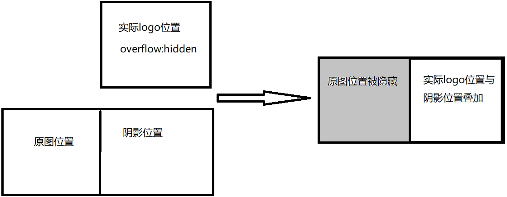
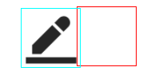
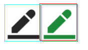
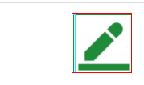

# 任意改变图片的颜色，再也不用让 UI 小姐姐做好几个状态的图片了

老板走到你的旁边说我觉得你的这个 logo 的颜色有点淡能调一下颜色吗？
鼠标滑动上去的时候颜色能变化一下吗？
What？这是图片哎，咋改颜色呀，不行让 UI 小姐姐给我在出个图片吧。
心想：万一老板心情又变了呢？老这样 UI 小姐姐会生气哦~

好的，我实现一下，老板放心，_……_

想到要改变图片的效果，首先想到的就是 css 里的 filter 属性，里面有像高斯模糊 blur()，改变图片亮度 brightness()等属性，其中还有一个属性阴影 drop-shadow(offset-x,offset-y,blur-radius,color),`offset-x`:偏离原图 x 轴的距离，`offset-y`:偏离原图的 y 轴的距离，`blur-radius`:阴影模糊程度，`color`:阴影颜色，看下面一张图片有什么想法呢？


  

```html
<div class="container">
  <div class="png-wrapper"></div>
</div>
```

```css
.container {
  position: relative;
  width: 48px;
  height: 48px;
  overflow: hidden;
  margin-left: 120px;
  border: 1px solid red;
}
.png-wrapper {
  position: relative;
  width: 48px;
  height: 48px;
  background: url("./edit.png") no-repeat center;
  background-size: 48px 48px;
  filter: drop-shadow(48px 0 rgb(32, 138, 59));
  transform: translateX(-48px);
  border: 1px solid aqua;
}
```

`注意:图片背景透明`
整个思路就是利用投影映射出跟图片一个一毛一样的东西，然后`transform:translateX(背景图的宽度)`通过`overflow:hidden`隐藏掉原来的背景图，就展现出了`drop-shadow`的样子，在通过调节`drop-shadow`的`color`属性来改变背景图的颜色，哦了~
